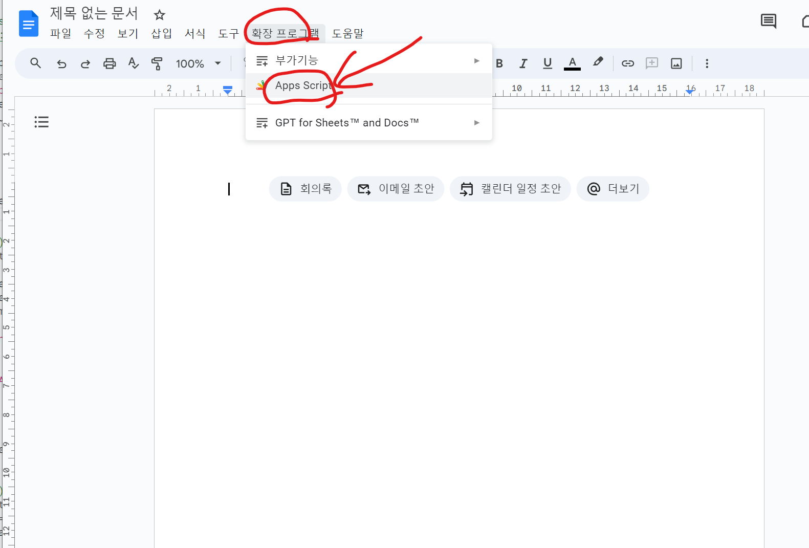
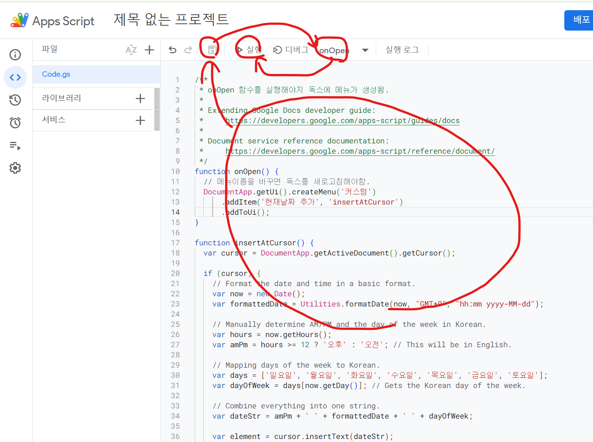
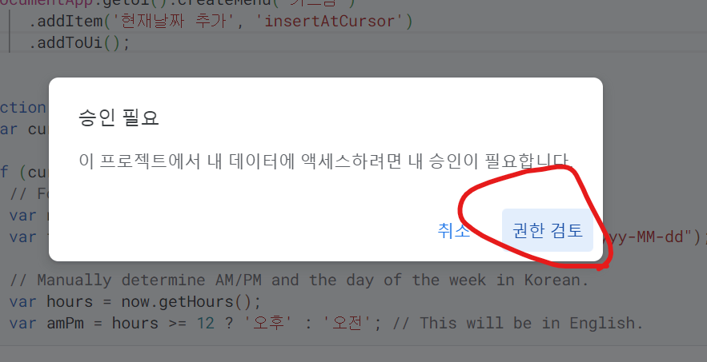
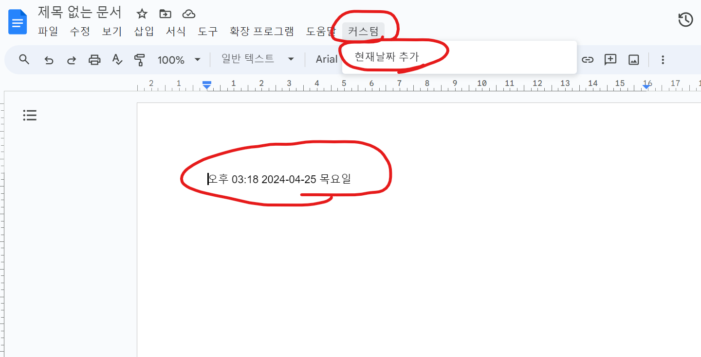

# 구글 독스에 현재 시간 추가하는 메뉴 만들기  
### 메뉴판에서 F5누르면 자동으로 현재시간 추가되는데, 독스에서 날짜추가를 못하니 불편하다.

- 독스에서 Apps script 실행  
  - 메뉴추가하고 싶은 독스 내에서 앱스스크립트 실행해야지 연결됨.  

  

- 코드 붙여넣기 > 저장 > onOpen 설정 > 실행

  

- 권한승인해주기

- 독스에서 커스텀 단추 > 현재날짜추가 누르기

